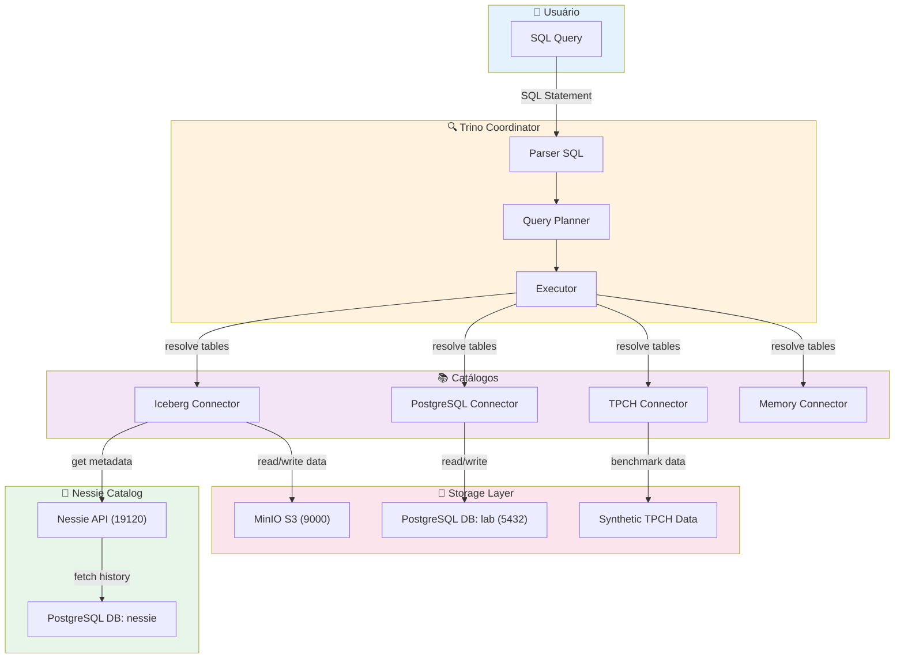
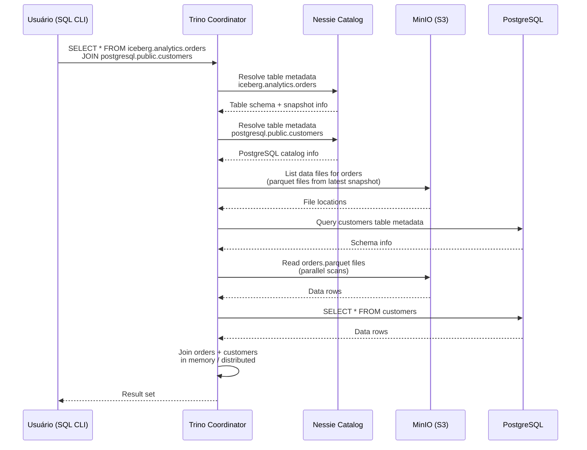

# Trino Lakehouse Lab

**Query engine distribuída federada + Apache Iceberg + Nessie + MinIO + PostgreSQL**

Laboratório local para educação e prototipagem em **arquitetura moderna de dados**.

---

## Visão Geral

Este repositório implementa um **Lakehouse completo em escala de laboratório**, permitindo praticar operações reais de:

- **Consulta federada** (query múltiplas fontes com uma engine SQL)
- **Lakehouse** (analytics desacoplado, open table formats, versionamento)
- **Data versioning** (commits de dados como Git)
- **Object storage** (arquivos em S3, localmente em MinIO)
- **Catalogs distribuídos** (Iceberg com Nessie)
- **OLTP + Analytics** (PostgreSQL + Data Lake no mesmo Trino)

**Objetivo educacional:** Construir intuição sólida sobre como query engines federadas funcionam em arquiteturas lakehouse modernas, sem precisar de cloud.

---

## Stack Utilizada

### **Trino** — Engine de Query SQL Distribuída

- Query engine que **consulta múltiplas fontes** (Iceberg, PostgreSQL, TPCH, Memory, etc.)
- Separa **compute de storage** (não armazena dados propriamente)
- Executa planos distribuídos em paralelo (single-node neste lab)
- **Porta:** `8080` (UI web + SQL API)
- **Papel:** Motor unificado de consulta

### **Apache Iceberg** — Open Table Format para Analytics

- Formato tabular ACID-compliant para data lakes
- Suporta **schema evolution**, **time-travel**, **snapshots**
- Armazena dados em arquivos Parquet + metadata em JSON
- Ideal para **writes++ queries**
- **Integração:** Via Nessie (catalog) + MinIO (storage físico)

### **Nessie** — Data Versioning Catalog

- Sistema de **versionamento de dados** (Git-like para tables)
- Suporta **branches e tags** em datasets
- Guarda metadata de histórico em PostgreSQL
- Permite **time-travel queries** e **reproducibility**
- **Porta:** `19120` (REST API)
- **Backend:** PostgreSQL database `nessie`

### **MinIO** — S3-Compatible Object Storage Local

- Almacena arquivos de data (Iceberg usa Parquet + metadata JSON)
- 100% compatível com S3 (boto3, hadoop fs, etc.)
- Bucket principal: `lakehouse/` (warehouse root)
- **Porta:** `9000` (API), `9001` (Web Console)
- **Papel:** Substitui S3 em ambiente local

### **PostgreSQL** — Armazenamento Relacional + Metastore

- **BD `nessie`:** Armazena metadata e histórico do Nessie
- **BD `lab`:** Banco transacional para dados OLTP/testes
- Acesso via Trino connector `postgresql` para queries federadas
- **Porta:** `5432`
- **Papel:** Backend persistente para Nessie + BD analítico acessível

### **Docker Compose** — Orquestração Local

- Define 5 serviços: Trino, PostgreSQL, Nessie, MinIO
- Rede interna para comunicação entre containers
- Volumes persistidos para dados

---

## Por Que Essa Arquitetura?

### **Federated Query vs Single Database**

| Aspecto            | Single DB         | Trino Federation               |
| ------------------ | ----------------- | ------------------------------ |
| Fonte              | Uma               | Múltiplas                      |
| Movimento de dados | Necessário (ETL)  | Desnecessário (query in-place) |
| Escalabilidade     | Limitada          | Borderless                     |
| Casos de uso       | OLTP/Transacional | Analytics/OLAP                 |

**Decisão:** Trino permite **consultar Iceberg + PostgreSQL + TPCH simultaneamente** sem copiar dados.

### **Iceberg vs Data Warehouse Tradicional**

| Aspecto         | Data Warehouse | Iceberg + Trino       |
| --------------- | -------------- | --------------------- |
| Schema          | Fixo           | Evoluível             |
| Tempo de viagem | Não            | Sim (snapshots)       |
| Commits         | Não            | Sim (ACID)            |
| Storage         | Proprietário   | Open format (Parquet) |
| Custo           | Alto           | Baixo (open source)   |

**Decisão:** Iceberg oferece governança moderna + portabilidade máxima.

### **Nessie vs Hive Metastore**

| Aspecto       | Hive Metastore | Nessie            |
| ------------- | -------------- | ----------------- |
| Versionamento | Não            | Sim               |
| Branches/Tags | Não            | Sim               |
| Histórico     | Limitado       | Git-like completo |
| Audit trail   | Não            | Sim               |

**Decisão:** Nessie adiciona **data governance moderna** (CI/CD para dados).

### **MinIO vs S3**

**Local:** MinIO oferece S3-compatible storage sem awscli / credenciais cloud.

**Real:** Em produção, substituir `s3.endpoint` por S3 real é uma linha.

### **PostgreSQL como Dual-Role**

1. **Metastore do Nessie:** Armazena histórico de dados
2. **BD operacional:** Dados OLTP acessíveis diretamente via Trino

**Benefício:** Simula workload real (analytics + operacional na mesma query).

---

## Arquitetura da Solução



---

## Fluxo de uma Query no Trino



**Etapas:**

1. **Parse SQL:** Sintaxe e validação
2. **Resolve Catalogs:** Nessie fornece metadata
3. **Plan Query:** Plano distribuído otimizado
4. **Execute Parallel:** Lê MinIO + PostgreSQL em paralelo
5. **Join + Aggregate:** In-memory ou spill to disk
6. **Return Results:** De volta ao cliente

---

## Estrutura do Repositório

```
trino-lab/
├── docker-compose.yml          Orquestração 5 serviços
├── README.md                    Documentação principal
├── LICENSE                      MIT
│
├── .env                         Variáveis de ambiente
├── .env.example                 Template de .env
├── .gitignore                   Exclui .env, .codespaces/*, volumes
│
├── single/etc/                  Configuração Trino single-node
│   ├── config.properties        Coordinator config
│   ├── node.properties          Node identity
│   ├── jvm.config               JVM tuning
│   │
│   └── catalog/                 Conectores Trino
│       ├── iceberg.properties   Iceberg + Nessie + MinIO config
│       ├── postgresql.properties PostgreSQL connector
│       ├── tpch.properties      TPCH synthetic data
│       └── memory.properties    In-memory cache
│
├── .postgres/init/              PostgreSQL initialization scripts
│   └── 01-init.sql              Cria databases nessie + lab
│
├── .codespaces/                 Codespaces specific config (ignored)
│   └── trino/                   Persistent data folders
│
└── docs/                        Documentação de estudo
    ├── QUICKSTART.md            Guia rápido
    ├── EXERCISES.md             Exercícios práticos (TPC-H)
```

---

## Instalação e Startup

### **Pré-requisitos**

- Docker + Docker Compose
- 4GB RAM disponível (JVM 1GB + containers)
- 10GB de espaço em disco (para persistência)

### **1. Clonar e Entrar**

```bash
git clone https://github.com/moreira-and/trino-lab.git
cd trino-lab
```

### **2. Subir Containers**

```bash
docker compose up -d
```

**Output esperado:**

```text
[+] Running 5/5
 ✔ postgres-lab
 ✔ minio-lab
 ✔ nessie
 ✔ minio-init
 ✔ trino-single
```

### **3. Validar Status**

```bash
docker compose ps
```

**Todos devem estar `UP`:**

```text
NAME              IMAGE                           STATUS
postgres-lab      postgres:16                     Up 2 minutes
minio-lab         minio/minio:latest              Up 2 minutes
nessie            ghcr.io/.../nessie:latest      Up 1 minute
trino-single      trinodb/trino:477               Up 30 seconds
```

### **4. Validar Conectividade**

```bash
curl http://localhost:8080/v1/info
```

**Resposta esperada (status 200):**

```json
{ "nodeVersion": { "version": "477.0" } }
```

### **5. Acessar WebUI Trino**

Browser:

```
http://localhost:8080
```

(Mostra queries em tempo real, nós ativos, etc.)

### **6. Acessar MinIO Console**

```
http://localhost:9001
```

**Credenciais:**

- User: `admin`
- Password: `admin12345`

---

## Executar Seu Primeiro SQL

### **Acesso ao CLI Trino**

```bash
docker exec -it trino-single trino
```

**Prompt:**

```
trino>
```

### **1. Validar Catálogos**

```sql
SHOW CATALOGS;
```

**Esperado:**

```
 Catalog
-----------
 iceberg
 memory
 postgresql
 system
 tpch
(5 rows)
```

### **2. Explorar TPC-H (Dataset Sintético)**

```sql
SHOW SCHEMAS FROM tpch;
SHOW TABLES FROM tpch.tiny;
SELECT * FROM tpch.tiny.nation LIMIT 10;
```

### **3. Criar Tabela em Iceberg**

```sql
CREATE SCHEMA IF NOT EXISTS iceberg.analytics
WITH (location = 's3://lakehouse/analytics/');

CREATE TABLE iceberg.analytics.customers AS
SELECT * FROM tpch.tiny.customer LIMIT 100;

SELECT COUNT(*) FROM iceberg.analytics.customers;
```

### **4. Criar Tabela em PostgreSQL**

```sql
CREATE TABLE postgresql.public.marketing_segments (
    customer_id INTEGER,
    segment VARCHAR,
    created_at TIMESTAMP
);

INSERT INTO postgresql.public.marketing_segments VALUES
(1, 'VIP', CURRENT_TIMESTAMP),
(2, 'STANDARD', CURRENT_TIMESTAMP);
```

### **5. JOIN Federado (Iceberg + PostgreSQL)**

```sql
SELECT
    c.custkey,
    c.name,
    c.acctbal,
    m.segment
FROM iceberg.analytics.customers c
JOIN postgresql.public.marketing_segments m
    ON c.custkey = m.customer_id;
```

### **6. Sair do CLI**

```sql
exit;
```

---

## Trilha de Estudo Recomendada

Este laboratório foi projetado para **educação prática e progressiva**.

**Tempo total:** ~9 horas para competência completa.

### **Nível 1 — Entender Catalogs (30 min)**

Subir ambiente, validar conectividade, explorar TPCH.

Referência: [QUICKSTART.md](docs/QUICKSTART.md)

### **Nível 2 — SQL Distribuído (1h)**

Exercises 1-4: dataset inspection, filtering, aggregations.

Referência: [EXERCISES.md](docs/EXERCISES.md) ex 1-4

### **Nível 3 — Joins e Dimensões (1h30min)**

Exercises 5-6: dimensional queries, revenue analysis, fact/dimension concepts.

Referência: [EXERCISES.md](docs/EXERCISES.md) ex 5-6

### **Nível 4 — Lakehouse Prático (2h)**

Exercises 12: criar schema Iceberg, CTAS, inserts, snapshots.

Referência: [EXERCISES.md](docs/EXERCISES.md) ex 12

### **Nível 5 — Query Federation (2h)**

Exercises 13: joins entre múltiplas datasources.

Referência: [EXERCISES.md](docs/EXERCISES.md) ex 13

### **Nível 6 — Query Plans (1h30min)**

Exercises 10-11: EXPLAIN analysis, query optimization.

Referência: [EXERCISES.md](docs/EXERCISES.md) ex 10-11

### **Nível 7 — Desafio Integrador (3h)**

Exercise 14: design query realista combinando todos os conceitos.

Referência: [EXERCISES.md](docs/EXERCISES.md) ex 14

---

## Limitações Atuais

Este laboratório **ensina arquitetura Lakehouse real, mas não é produção**.

### **Escalabilidade**

- ✅ Single-node (laptop para testar conceitos)
- ❌ Distributed query (verdadeiramente paralelo precisaria múltiplos Trino workers)

### **Performance**

- ✅ TPCH `tiny` (1GB) roda em segundos
- ⚠️ TPCH `sf1` (10GB) pode ser lento

### **Observabilidade**

- ✅ WebUI Trino (queries em tempo real)
- ❌ Prometheus/Grafana (não instalado)

### **Segurança**

- ⚠️ Sem TLS (http apenas)
- ⚠️ Credenciais em env (admin/admin123)
- ❌ Sem RBAC/LDAP/OAuth

---

## Evolução Futura (Roadmap)

### **Camada 1 — Multi-Node**

Expandir para 1 coordinator + 2 workers.

Ganho: Distribuided execution real.

### **Camada 2 — dbt + Orchestration**

Adicionar dbt para transformações, Airflow para scheduling.

Ganho: ELT prático.

### **Camada 3 — Observabilidade**

Prometheus + Grafana para métricas.

Ganho: Query metrics, JVM profiling.

### **Camada 4 — Hive Metastore**

Substituir Nessie por Hive Metastore (mais popular em produção).

Ganho: Compatibilidade com big data ecosystem.

### **Camada 5 — Kafka Connector**

Adicionar Kafka para streaming analytics.

Ganho: Real-time + Iceberg.

---

## Conceitos-Chave

### **Federated Query**

Trino consulta **múltiplas datasources na mesma query** sem copiar dados.

```sql
SELECT t1.col1, t2.col2
FROM source_x.schema.table1 t1
JOIN source_y.schema.table2 t2 ON t1.id = t2.id;
```

### **Open Table Format (Iceberg)**

Não proprietário, portável, ACID, schema evolution.

```sql
-- Schema evolution
ALTER TABLE iceberg.analytics.customer ADD COLUMN created_at TIMESTAMP;

-- Time-travel
SELECT * FROM iceberg.analytics.customer
FOR SYSTEM_TIME AS OF TIMESTAMP '2025-01-10 10:00:00';
```

### **Decoupling (Compute vs Storage)**

```
Traditional DW: Compute + Storage = Black Box

Trino Lakehouse:
  ├─ Compute: Trino stateless
  ├─ Storage: MinIO persistent
  └─ Separados: Escala independente
```

---

## Comandos Úteis

### **Docker**

```bash
docker compose up -d              # Subir
docker compose ps                 # Status
docker compose logs -f trino-single  # Logs
docker compose down               # Parar
docker compose down -v            # Parar + remover volumes
docker exec -it trino-single trino  # Acessar CLI
```

### **SQL (Trino CLI)**

```sql
SHOW CATALOGS;
SHOW SCHEMAS FROM iceberg;
SHOW TABLES FROM iceberg.analytics;
DESCRIBE iceberg.analytics.orders;
EXPLAIN SELECT ...;
```

---

## Troubleshooting

### **Trino não inicia**

```bash
docker logs trino-single | tail 50
```

Cause comum: JVM heap ou porta 8080 ocupada.

### **Iceberg queries falham**

Cause: Nessie não alcançável ou PostgreSQL fora.

```bash
curl http://localhost:19120/api/v2/content
docker exec postgres-lab psql -U admin -c "SELECT 1;"
```

### **MinIO bucket não existe**

```bash
docker exec minio-lab mc mb local/lakehouse
```

### **Queries lentas**

Check WebUI: http://localhost:8080/ui/

---

## Referências Oficiais

- **Trino:** https://trino.io/docs/current/
- **Apache Iceberg:** https://iceberg.apache.org/docs/latest/
- **Nessie:** https://projectnessie.org/docs/
- **MinIO:** https://docs.min.io/
- **PostgreSQL:** https://www.postgresql.org/docs/
- **TPC-H:** https://www.tpc.org/tpch/

---

## Mentalidade Correta

**Trino não é "mais um banco".**

É uma **engine distribuída de query desacoplada de storage**, permitindo federated queries em múltiplas fontes com separação clara de compute/storage.

---

## Próximas Ações

1. **Subir ambiente:** `docker compose up -d`
2. **Validar:** `curl http://localhost:8080/v1/info`
3. **Estudar:** [Trilha de Estudo](#trilha-de-estudo-recomendada)
4. **Praticar:** [EXERCISES.md](docs/EXERCISES.md)

---

## Licença

MIT License. Veja [LICENSE](LICENSE).
